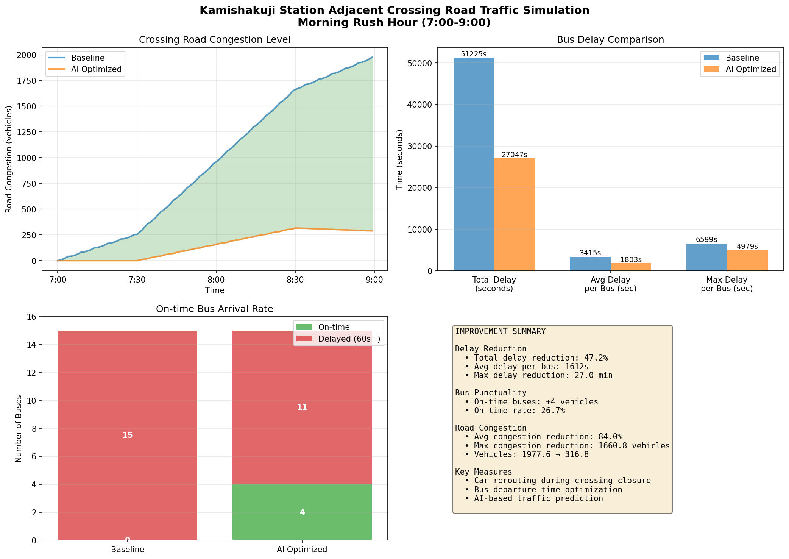

# 上石神井駅周辺 交通シミュレーション

**Kamishakujii Station Traffic Simulation**

西武新宿線・上石神井駅隣接踏切が引き起こす朝ラッシュ時の交通渋滞に対して、AI交通誘導・自動運転バスの2案を導入した場合の効果をシミュレーションで数値化・検証するプロジェクトです。

---

## 📋 プロジェクト概要

| 項目 | 内容 |
|------|------|
| 対象エリア | 東京都練馬区 上石神井駅周辺（西武新宿線） |
| 対象時間帯 | 朝ラッシュ 7:00〜9:00 |
| 踏切閉鎖率 | **87.5%**（7〜9時台・実データより） |
| 待機台数上限 | 35台（固定） |
| 比較パターン | 4パターン（現状 / AI誘導のみ / 自動運転のみ / 両方導入） |

### 背景

上石神井駅のロータリーに隣接する踏切は、朝ラッシュ時に2時間中105分閉鎖（閉鎖率87.5%）という極めて高い閉鎖率を示す。これにより、バス遅延・一般車渋滞・ロータリー混雑が慢性化している。なお、当踏切は高架化工事（立体交差化）が着工から1年以上経過しているが、現時点では具体的な進捗は確認できない。

---

## 💡 提案する2つの解決策

### 案①：AI交通誘導
リアルタイム交通データで一般車を新青梅街道方面へ迂回誘導し、踏切前の混雑を削減する。

- 迂回率：通常5% → **32%** に向上
- 効果：踏切前一般車を削減 → 閉鎖中累積待機を **▼39.9%** 削減

### 案②：自動運転バス
バスの位置情報をリアルタイムに取得し、踏切開放タイミングに合わせて走行速度を調整する。

- 調整窓：踏切閉鎖まで **2分以内** なら開放直前着に速度調整
- 効果：遅延ありバスを 23本 → **15本**（▼35%）、平均遅延 ▼9.2%

---

## 📊 最終シミュレーション結果（上限35台）

| パターン | 平均バス遅延 | 遅延削減率 | 遅延ありバス | 閉鎖中累積待機 | 累積待機削減率 |
|----------|------------|-----------|------------|--------------|--------------|
| ①現状     | 4.25分      | —         | 23本/28本   | 1,009台分     | —            |
| ②AI誘導   | 4.25分      | 0.0%      | 23本/28本   | **606台分**   | **▼39.9%**   |
| ③自動運転  | **3.86分**  | **▼9.2%** | **15本/28本**| 1,009台分    | 0.0%         |
| ④両方導入  | **3.86分**  | **▼9.2%** | **15本/28本**| **606台分**  | **▼39.9%**   |

---

## 🧪 統計検定結果

閉鎖率を 0%〜95% の11水準で変化させ、各水準N=30回のモンテカルロシミュレーションを実施（総計1,320レコード）。

### ① 相関分析（Pearson）
全パターンで閉鎖率とバス遅延・累積待機の間に**強い正の相関（r = 0.78〜0.84、p < .001）**を確認。踏切閉鎖率が高いほど遅延・混雑が増加することは統計的に有意。

### ② 一元配置ANOVA
**F = 19.70、p < .001（\*\*\*）**

自動運転バスの遅延削減効果は閉鎖率グループ間で有意差あり → **施策効果は踏切閉鎖率に依存する**。

### ③ 線形回帰（高架化完成時の推定）

| パターン | 現状(87.5%) | 高架化完成(0%) | 削減推定 |
|---------|------------|--------------|---------|
| ①現状   | 4.61分      | **0.14分**   | ▼4.47分 |
| ②AI誘導 | 4.61分      | **0.14分**   | ▼4.47分 |
| ③自動運転| 4.31分     | **0.10分**   | ▼4.21分 |
| ④両方   | 4.31分      | **0.10分**   | ▼4.21分 |

高架化完成により、どの施策でも平均バス遅延は **約0.1分（6秒）** まで解消される見込み。

---

## 🗂️ ファイル構成

```
kamishakujii-traffic-simulation/
│
├── data/
│   ├── train_schedule.json              # 西武新宿線 全列車時刻（2025年3月改正）
│   ├── crossing_status_per_minute.csv   # 1分単位の踏切開閉状態（4:00〜23:59）
│   ├── closure_by_hour.csv              # 時間帯別閉鎖統計
│   ├── closure_intervals.csv            # 連続閉鎖区間リスト
│   ├── bus_timetable_master.csv         # バス時刻表（208本・全系統）
│   └── schema.json                      # 各CSVのフィールド定義
│
├── img/
│   └── A.png                            # 上石神井駅周辺バスルート説明図
│
├── final_summary.py                     # 最終シミュレーション（上限35台・4パターン比較）
├── statistical_test.py                  # 統計検定（相関・ANOVA・回帰・モンテカルロ）
└── README.md
```

---

## 📁 データ仕様

### `crossing_status_per_minute.csv`
| フィールド | 説明 |
|-----------|------|
| `abs_minute` | 0時0分基準の絶対分（例: 7:30 = 450） |
| `is_closed` | 踏切閉鎖フラグ（1=閉鎖、0=開放） |
| `closed_by_down` / `closed_by_up` | 下り/上り列車による閉鎖フラグ |
| `closure_cause` | 閉鎖原因（down / up / both / none） |

### `bus_timetable_master.csv`
| フィールド | 説明 |
|-----------|------|
| `route` | 系統（吉60・西03・泉35・みどりバス） |
| `crosses_crossing` | 踏切通過フラグ（True/False） |
| `stop_duration_seconds` | 停車時間（秒） |

踏切を通過する系統：**吉60・西03**（北行き・南行き両方向）  
踏切を通過しない系統：泉35（ロータリー直入）・みどりバス（ロータリー内折り返し）

---

## ⚙️ シミュレーション仕様

### モデル設計

```
【交通量モデル】
  一般車到着率:  ピーク時(7:20-8:20) 1.5台/分
                肩時間              1.0台/分
  到着分布:      ポアソン分布
  踏切通過速度:  4秒/台
  待機上限:      35台（固定）

【AI交通誘導モデル】
  通常迂回率:    5%
  AI誘導時迂回率: 32%（新青梅街道方面）

【自動運転バスモデル】
  調整条件:      踏切閉鎖まで2分以内のバスを対象
  調整内容:      速度調整により踏切開放直前に到着させ待機時間ゼロに
```

### 踏切閉鎖パラメータ（実データより）

| 指標 | 値 |
|------|-----|
| 閉鎖率（7-9時） | 87.5%（105分/120分） |
| 閉鎖回数 | 12回 |
| 平均閉鎖時間 | 7.9分 |
| 最長閉鎖時間 | 18分 |

---

## 🚀 実行方法

### 必要環境

```bash
pip install pandas numpy matplotlib scipy
```

### 最終シミュレーション実行

```bash
python final_summary.py
# 出力: final_summary.png（KPIカード・待機台数推移・交通量指標・サマリ表）
```

### 統計検定実行

```bash
python statistical_test.py
# 出力: statistical_test.png（相関・ANOVA・回帰・高架化推定）
# ※ N=30 × 11閉鎖率水準 のモンテカルロ実行のため数分かかります
```

### データファイルのパス設定

コード冒頭の読み込みパスを環境に合わせて変更してください。

```python
crossing_df  = pd.read_csv('data/crossing_status_per_minute.csv')
intervals_df = pd.read_csv('data/closure_intervals.csv')
buses_df     = pd.read_csv('data/bus_timetable_master.csv')
```

---

## 🗺️ バスルート概要

```
地点定義（A.png参照）
  A（赤丸）: 三菱UFJ銀行ATM付近・乗車専用停留所
  B（赤丸）: ロータリー内停留所
  C（赤丸）: 降車専用停留所

系統別ルート
  吉60 北行き: 6 → 4-L(踏切) → 2 → B停車 → 3 → 1-L
  吉60 南行き: 1-R → C降車 → 4-R(踏切) → 5 → A乗車
  西03 北行き: 6 → 4-L(踏切) → 2 → B停車 → 3 → 1-L
  西03 南行き: 1-R → C降車 → 4-R(踏切) → 5 → A乗車
  泉35 始発:   C降車のみ → 2 → B始発 → 3 → 1-L  ※踏切なし
```

---

## 📝 考察・まとめ

- **案①（AI交通誘導）** は一般車渋滞の解消に有効。バス遅延そのものには影響しないが、踏切前混雑度を約40%削減する。
- **案②（自動運転バス）** はバスの定時性改善に直接効果があり、遅延ありバスを35%削減する。
- **両方導入（④）** がバス遅延・一般車混雑の両方に対処できる最良の組み合わせ。
- **統計的に確認**: 自動運転の効果は閉鎖率依存（ANOVA p < .001）。高架化完成で閉鎖率が0%になれば、遅延はほぼ **0.1分（6秒）** まで解消される見込み。
- 現在の2案はあくまで **高架化完成までの暫定的改善策** として有効。

---

## 📚 データソース

| データ | 出典 |
|--------|------|
| バス時刻表 | Navitime（吉60・西03・泉35・みどりバス） |
| 列車時刻 | 西武鉄道 西武新宿線 上石神井駅（2025年3月15日改正） |
| 踏切閉鎖データ | 列車時刻より算出（閉鎖時間=1.5分/列車、特急は連続閉鎖） |
| 現地情報 | 現地確認（ロータリー構造・バス停位置・道路幅員） |

---

## 👤 作成者

地域探求プロジェクト（練馬区立 上石神井駅周辺 交通問題研究）

---

*最終更新: 2026年3月*